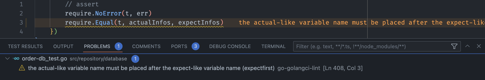

# expectfirst

This linter checks argument order of test assertion. The expected-like variable name must be placed before the actual-like variable name.

For example:

```go
require.Equal(t, expectNum, actualNum) // pass
require.Equal(t, actualNum, expectNum) // warn
```

In VScode:



### Installation

1. `git clone https://github.com/JiaheEatingOut/expectfirst`
2. `cd expectfirst`
3. `make build`
4. `go install github.com/golangci/golangci-lint/cmd/golangci-lint@v1.52.2`
   (Install golangci-lint and custom linter locally, so that they are compile with the exact same stack, it's related to how Go plugins work.)
5. Add the below configs to your project `.golingci.yml`

```yaml
linters-settings:
  custom:
    expectfirst:
      path: "<LINTER_FOLDER>/expectfirst.so"

linters:
  enable:
    - expectfirst
```

5. Ready to Go!

### Development

Add more rules:

1. Add rule to `pkg/analyzer/`
2. Add test to `testdata/`
3. Run `make test`
4. Update `.golangci.yml`
